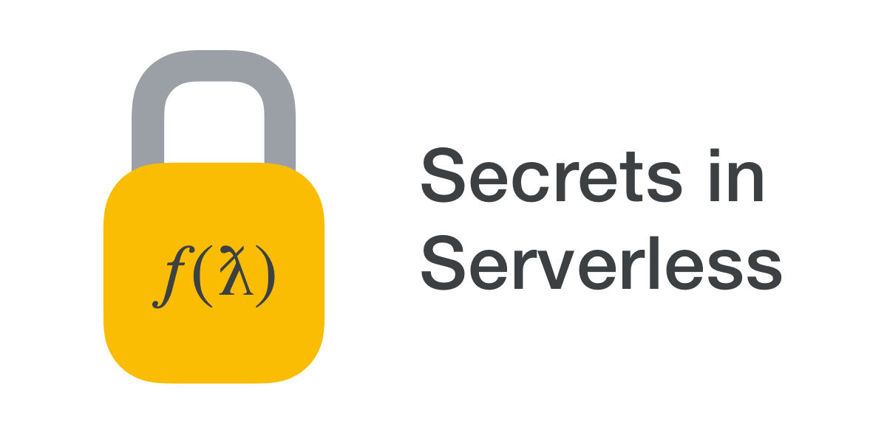

# Secrets in Serverless



This repository contains a collection of samples and examples for managing
secrets in serverless lambda applications and cloud functions. The samples
correspond to my [Secrets in Serverless blog post][post].

There are examples in Go, Node, and Python for each of the examples. The
examples use [Google Cloud Functions][gcp-gcf], but the concepts are largely
applicable to other serverless technologies like AWS Lambda.

Each folder has its own set of examples and README to follow. Please click on
a folder for more information.

- **[Environment variables](envvars)** - store and retrieve secrets via
  environment variables.

- **[Encrypted environment variables](encrypted-envvars)** - store and retrieve
  secrets via environment variables whose values are encrypted with a KMS
  provider.

- **[Google Cloud Storage](gcs)** - store secrets in files on
  [Google Cloud Storage][gcp-gcs] and tightly control access via IAM.


## Contributing

If you would like to add a new language, please add it to **all** the examples.
I want to provide a consistent experience for each example. Similarly, if you
are adding a new example, please write it in all supported languages.


## License & Copyright

```text
Copyright 2018 Seth Vargo
Copyright 2018 Google, Inc.

Licensed under the Apache License, Version 2.0 (the "License");
you may not use this file except in compliance with the License.
You may obtain a copy of the License at

    http://www.apache.org/licenses/LICENSE-2.0

Unless required by applicable law or agreed to in writing, software
distributed under the License is distributed on an "AS IS" BASIS,
WITHOUT WARRANTIES OR CONDITIONS OF ANY KIND, either express or implied.
See the License for the specific language governing permissions and
limitations under the License.
```


[post]: https://www.sethvargo.com/secrets-in-serverless
[gcp-gcf]: https://cloud.google.com/functions
[gcp-gcs]: https://cloud.google.com/storage
